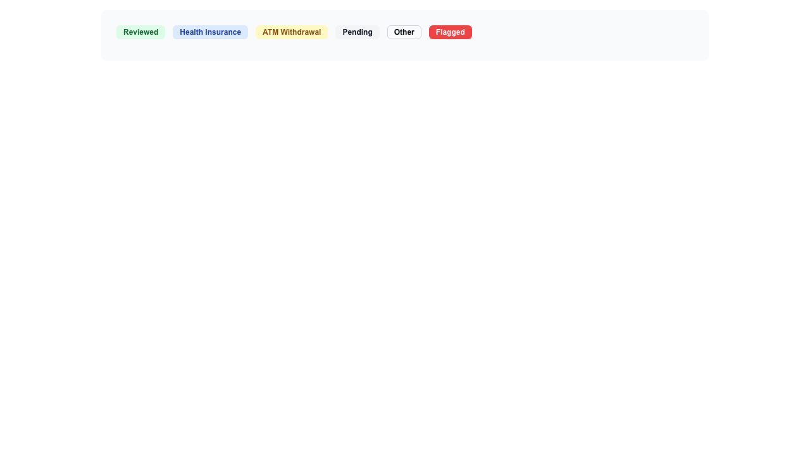
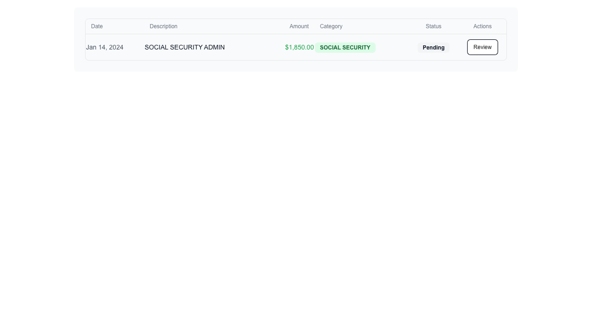
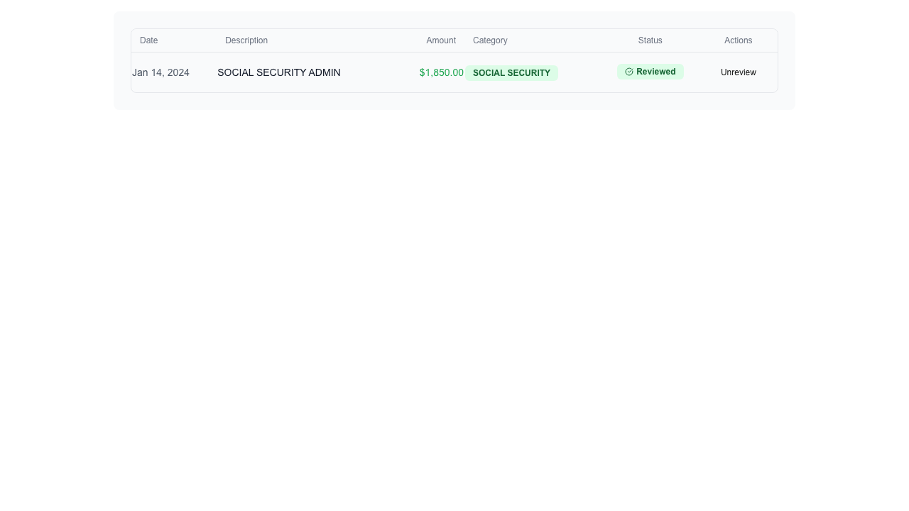
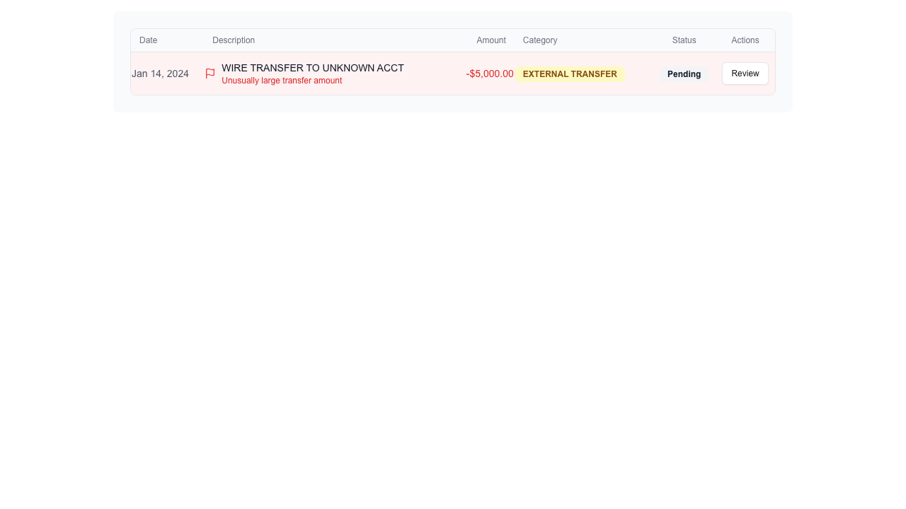
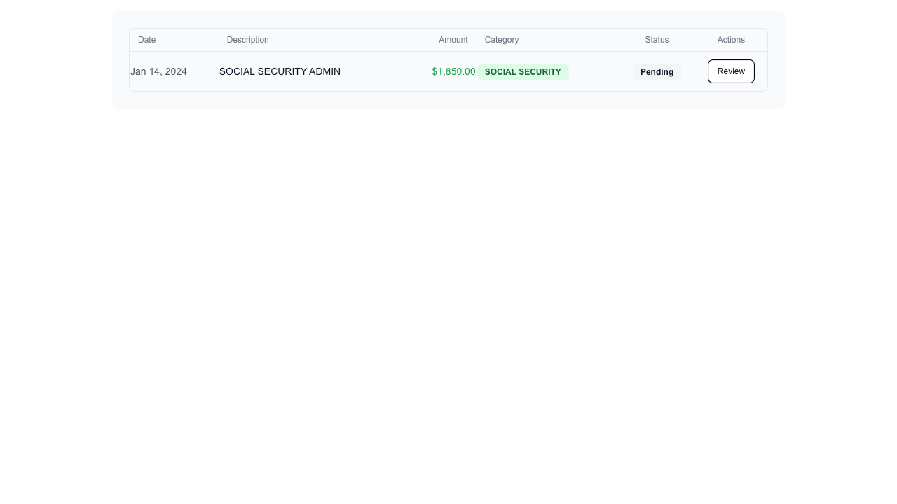
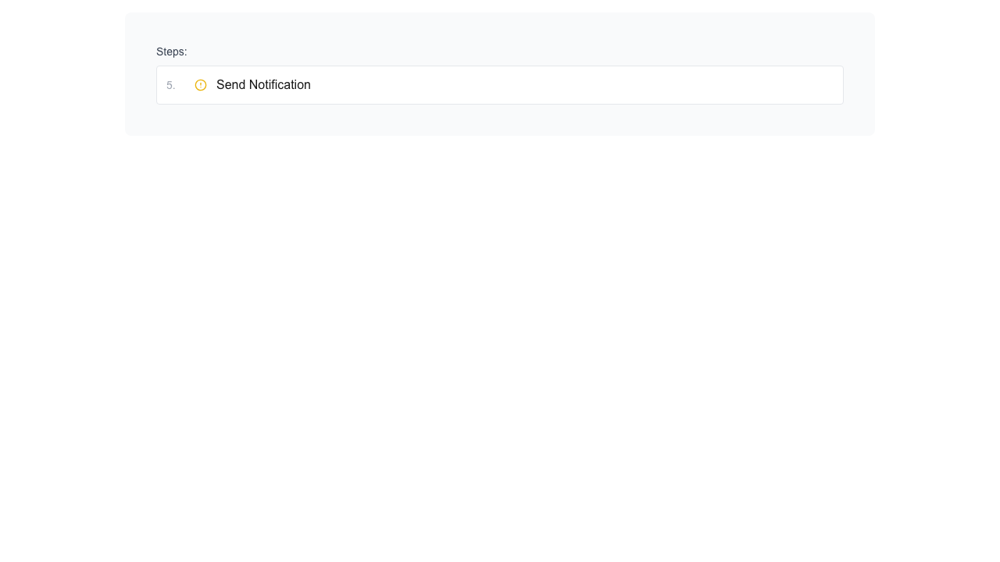
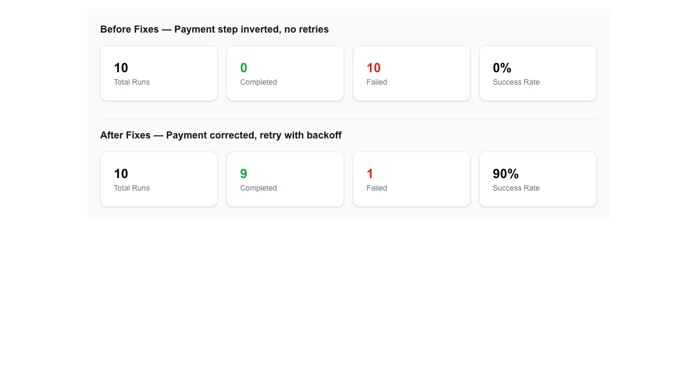

# Storybook Component Test Results

> Generated: 2026-03-20T03:02:17.861Z

**7/7 passed** 

| Story | Status | Duration | Artifacts |
|-------|--------|----------|-----------|
| ✅ Badge: AllVariants renders all 6 badge labels | passed | 990ms | [screenshot](../artifacts/storybook/badge-allvariants-renders-all-6-badge-labels.png) · [video](../artifacts/storybook/badge-allvariants-renders-all-6-badge-labels.webm) · [trace](../artifacts/storybook/badge-allvariants-renders-all-6-badge-labels-trace.zip) |
| ✅ TransactionRow: Default shows Pending badge and Review button | passed | 648ms | [screenshot](../artifacts/storybook/transactionrow-default-shows-pending-badge-and-review-button.png) · [video](../artifacts/storybook/transactionrow-default-shows-pending-badge-and-review-button.webm) · [trace](../artifacts/storybook/transactionrow-default-shows-pending-badge-and-review-button-trace.zip) |
| ✅ TransactionRow: Reviewed shows green Reviewed badge and Unreview button | passed | 635ms | [screenshot](../artifacts/storybook/transactionrow-reviewed-shows-green-reviewed-badge-and-unreview-button.png) · [video](../artifacts/storybook/transactionrow-reviewed-shows-green-reviewed-badge-and-unreview-button.webm) · [trace](../artifacts/storybook/transactionrow-reviewed-shows-green-reviewed-badge-and-unreview-button-trace.zip) |
| ✅ TransactionRow: Flagged shows red background and flag reason | passed | 768ms | [screenshot](../artifacts/storybook/transactionrow-flagged-shows-red-background-and-flag-reason.png) · [video](../artifacts/storybook/transactionrow-flagged-shows-red-background-and-flag-reason.webm) · [trace](../artifacts/storybook/transactionrow-flagged-shows-red-background-and-flag-reason-trace.zip) |
| ✅ TransactionRow: Review button click triggers callback | passed | 647ms | [screenshot](../artifacts/storybook/transactionrow-review-button-click-triggers-callback.png) · [video](../artifacts/storybook/transactionrow-review-button-click-triggers-callback.webm) · [trace](../artifacts/storybook/transactionrow-review-button-click-triggers-callback-trace.zip) |
| ✅ WorkflowStep: all 5 statuses render correctly | passed | 1320ms | [screenshot](../artifacts/storybook/workflowstep-all-5-statuses-render-correctly.png) · [video](../artifacts/storybook/workflowstep-all-5-statuses-render-correctly.webm) · [trace](../artifacts/storybook/workflowstep-all-5-statuses-render-correctly-trace.zip) |
| ✅ WorkflowSuccessRate: Comparison shows before/after impact | passed | 462ms | [screenshot](../artifacts/storybook/workflowsuccessrate-comparison-shows-beforeafter-impact.png) · [video](../artifacts/storybook/workflowsuccessrate-comparison-shows-beforeafter-impact.webm) · [trace](../artifacts/storybook/workflowsuccessrate-comparison-shows-beforeafter-impact-trace.zip) |

## Details

### ✅ Badge: AllVariants renders all 6 badge labels



<details><summary>Proof Chain + API Log</summary>

```
BUG: Badge component renders all transaction domain variants
============================================================

PROOF CHAIN
----------------------------------------
✅ PROVED: Badge "Reviewed" is visible
   Expected: true
   Actual:   true

✅ PROVED: Badge "Health Insurance" is visible
   Expected: true
   Actual:   true

✅ PROVED: Badge "ATM Withdrawal" is visible
   Expected: true
   Actual:   true

✅ PROVED: Badge "Pending" is visible
   Expected: true
   Actual:   true

✅ PROVED: Badge "Other" is visible
   Expected: true
   Actual:   true

✅ PROVED: Badge "Flagged" is visible
   Expected: true
   Actual:   true

✅ PROVED: All 6 badge variants rendered
   Expected: visible badges = expected
   Actual:   6 = 6 → true

API REQUEST LOG
----------------------------------------

VERDICT: 7/7 assertions proved
```
</details>

Video: [badge-allvariants-renders-all-6-badge-labels.webm](../artifacts/storybook/badge-allvariants-renders-all-6-badge-labels.webm)

Trace: `pnpm exec playwright show-trace artifacts/storybook/badge-allvariants-renders-all-6-badge-labels-trace.zip`

### ✅ TransactionRow: Default shows Pending badge and Review button



<details><summary>Proof Chain + API Log</summary>

```
BUG: TransactionRow default state renders unreviewed transaction with correct data
============================================================

PROOF CHAIN
----------------------------------------
✅ PROVED: Pending badge visible (unreviewed state)
   Expected: true
   Actual:   true

✅ PROVED: Review button visible
   Expected: true
   Actual:   true

✅ PROVED: Transaction description rendered
   Expected: true
   Actual:   true

API REQUEST LOG
----------------------------------------

VERDICT: 3/3 assertions proved
```
</details>

Video: [transactionrow-default-shows-pending-badge-and-review-button.webm](../artifacts/storybook/transactionrow-default-shows-pending-badge-and-review-button.webm)

Trace: `pnpm exec playwright show-trace artifacts/storybook/transactionrow-default-shows-pending-badge-and-review-button-trace.zip`

### ✅ TransactionRow: Reviewed shows green Reviewed badge and Unreview button



<details><summary>Proof Chain + API Log</summary>

```
BUG: TransactionRow reviewed state shows correct badge and toggle direction
============================================================

PROOF CHAIN
----------------------------------------
✅ PROVED: Reviewed badge visible (reviewed state)
   Expected: true
   Actual:   true

✅ PROVED: Unreview button visible (toggle direction correct)
   Expected: true
   Actual:   true

API REQUEST LOG
----------------------------------------

VERDICT: 2/2 assertions proved
```
</details>

Video: [transactionrow-reviewed-shows-green-reviewed-badge-and-unreview-button.webm](../artifacts/storybook/transactionrow-reviewed-shows-green-reviewed-badge-and-unreview-button.webm)

Trace: `pnpm exec playwright show-trace artifacts/storybook/transactionrow-reviewed-shows-green-reviewed-badge-and-unreview-button-trace.zip`

### ✅ TransactionRow: Flagged shows red background and flag reason



<details><summary>Proof Chain + API Log</summary>

```
BUG: TransactionRow flagged state shows visual warning indicators
============================================================

PROOF CHAIN
----------------------------------------
✅ PROVED: Flag reason text visible
   Expected: true
   Actual:   true

✅ PROVED: Row has red background (bg-red-50)
   Expected: true
   Actual:   true

API REQUEST LOG
----------------------------------------

VERDICT: 2/2 assertions proved
```
</details>

Video: [transactionrow-flagged-shows-red-background-and-flag-reason.webm](../artifacts/storybook/transactionrow-flagged-shows-red-background-and-flag-reason.webm)

Trace: `pnpm exec playwright show-trace artifacts/storybook/transactionrow-flagged-shows-red-background-and-flag-reason-trace.zip`

### ✅ TransactionRow: Review button click triggers callback



<details><summary>Proof Chain + API Log</summary>

```
BUG: TransactionRow review toggle interaction works without errors
============================================================

PROOF CHAIN
----------------------------------------
✅ PROVED: Review button was clickable
   Expected: true
   Actual:   true

✅ PROVED: Component still rendered after click (no crash)
   Expected: true
   Actual:   true

API REQUEST LOG
----------------------------------------

VERDICT: 2/2 assertions proved
```
</details>

Video: [transactionrow-review-button-click-triggers-callback.webm](../artifacts/storybook/transactionrow-review-button-click-triggers-callback.webm)

Trace: `pnpm exec playwright show-trace artifacts/storybook/transactionrow-review-button-click-triggers-callback-trace.zip`

### ✅ WorkflowStep: all 5 statuses render correctly



<details><summary>Proof Chain + API Log</summary>

```
BUG: WorkflowStep component renders all 5 status states with correct icons and data
============================================================

PROOF CHAIN
----------------------------------------
✅ PROVED: Step "Process Payment" visible in completed
   Expected: true
   Actual:   true

✅ PROVED: Duration "150ms" shown
   Expected: true
   Actual:   true

✅ PROVED: Step "Check Inventory" visible in failed
   Expected: true
   Actual:   true

✅ PROVED: Error "Connection timeout" shown
   Expected: true
   Actual:   true

✅ PROVED: Step "Create Shipment" visible in running
   Expected: true
   Actual:   true

✅ PROVED: Step "Send Notification" visible in pending
   Expected: true
   Actual:   true

✅ PROVED: Step "Send Notification" visible in skipped
   Expected: true
   Actual:   true

✅ PROVED: All 5 workflow step statuses rendered
   Expected: rendered = expected
   Actual:   5 = 5 → true

API REQUEST LOG
----------------------------------------

VERDICT: 8/8 assertions proved
```
</details>

Video: [workflowstep-all-5-statuses-render-correctly.webm](../artifacts/storybook/workflowstep-all-5-statuses-render-correctly.webm)

Trace: `pnpm exec playwright show-trace artifacts/storybook/workflowstep-all-5-statuses-render-correctly-trace.zip`

### ✅ WorkflowSuccessRate: Comparison shows before/after impact



<details><summary>Proof Chain + API Log</summary>

```
BUG: WorkflowSuccessRate comparison documents the business impact of reliability fixes
============================================================

PROOF CHAIN
----------------------------------------
✅ PROVED: Before fixes section visible
   Expected: true
   Actual:   true

✅ PROVED: After fixes section visible
   Expected: true
   Actual:   true

✅ PROVED: 0% success rate shown (before)
   Expected: true
   Actual:   true

✅ PROVED: 90% success rate shown (after)
   Expected: true
   Actual:   true

API REQUEST LOG
----------------------------------------

VERDICT: 4/4 assertions proved
```
</details>

Video: [workflowsuccessrate-comparison-shows-beforeafter-impact.webm](../artifacts/storybook/workflowsuccessrate-comparison-shows-beforeafter-impact.webm)

Trace: `pnpm exec playwright show-trace artifacts/storybook/workflowsuccessrate-comparison-shows-beforeafter-impact-trace.zip`
